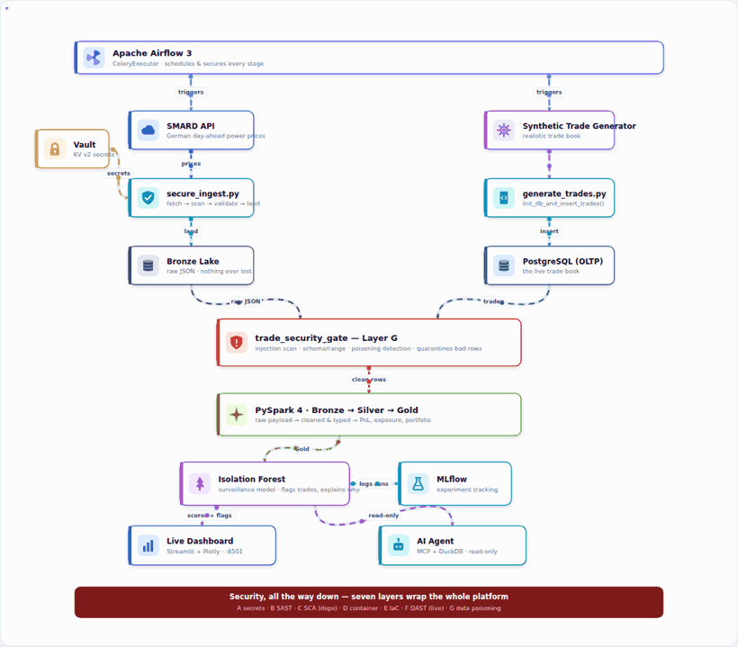

# ETRM Data Platform


> An automated, secured **Energy Trading and Risk Management** lakehouse.
> It ingests real European electricity prices, defends the pipeline at seven
> security layers, transforms everything with **Apache Spark**, detects
> suspicious trades with a **machine-learning surveillance model**, and serves
> the result to a **live dashboard** and an **AI agent** you can ask questions
> in plain language.

## Architecture



<sub>
A CDC-secured medallion lakehouse. <b>Airflow</b> schedules every stage; <b>Vault</b> supplies secrets; the
<b>Layer&nbsp;G</b> security gate quarantines bad rows (it never crashes the run); <b>PySpark</b> builds
Bronze&nbsp;→&nbsp;Silver&nbsp;→&nbsp;Gold; an <b>Isolation&nbsp;Forest</b> flags suspicious trades and explains why; and a
<b>Streamlit</b> dashboard plus a read-only <b>AI agent</b> serve the results.
<br><br>
▶ <b><a href="https://htmlpreview.github.io/?https://github.com/Saeidshahriari/etrm-data-platform/blob/main/docs/etrm_architecture_animated.html">Interactive animated version</a></b>
&nbsp;·&nbsp;
✎ <b><a href="docs/etrm_architecture.drawio">Editable draw.io source</a></b>
&nbsp;·&nbsp;
🖼 <b><a href="docs/images/architecture.png">Static PNG</a></b>
</sub>

```bash
make up        # start the whole platform
make pipeline  # run it end to end
make security  # run every security scan
```

---

## Table of Contents

- [Architecture](#architecture)
- [What this platform does](#what-this-platform-does)
- [Stack and versions](#stack-and-versions)
- [Repository layout](#repository-layout)
- [Quick start](#quick-start)
- [Operations](#operations)
- [The ML model: REMIT market-abuse surveillance](#the-ml-model-remit-market-abuse-surveillance)
- [Security: seven layers](#security-seven-layers)
- [Verification](#verification)
- [Troubleshooting](#troubleshooting)
- [A note on Spark mode](#a-note-on-spark-mode)
- [Honest limitations](#honest-limitations)
- [References](#references)
- [License](#license)

---

## What this platform does

```
                          ┌──────────────────────────────┐
                          │      Apache Airflow 3         │
                          │  schedules & secures the run  │
                          └───────────────┬──────────────┘
                                          │
      ┌───────────────────────────────────┼───────────────────────────┐
      ▼                                   ▼                           │
 generate_trades                   secure_ingest                      │
 (synthetic book)              SMARD API -> scan -> validate          │
      │                                   │                           │
      ▼                                   ▼                           │
 PostgreSQL (OLTP)                  Bronze (raw JSON)                 │
      │                                   │                           │
      └──────► trade_security_gate ◄──────┘                           │
                (injection + poisoning checks)                        │
                        │                                             │
                        ▼                                             │
              PySpark 4: Bronze -> Silver -> Gold                     │
                        │                                             │
                        ▼                                             │
              ML surveillance model (Isolation Forest)                │
                        │                                             │
          ┌─────────────┴──────────────┐                              │
          ▼                            ▼                              │
   Live dashboard              AI agent (MCP + DuckDB)  ◄─────────────┘
   localhost:8501              ask questions in plain language
```

**Medallion architecture.** Bronze holds the raw payload exactly as the API
returned it, so nothing is ever lost. Silver holds cleaned and typed data.
Gold holds business answers: profit and loss per trade, exposure per
counterparty, and a portfolio summary.

---

## Stack and versions

Versions below are the ones actually pinned in this repository, taken from
`requirements.txt`, `Dockerfile` and `docker-compose.yml`.

| Component | Role | Version |
|-----------|------|---------|
| Apache Airflow | Orchestration, CeleryExecutor | `3.0.4` (custom image `etrm-airflow:3.0.4`) |
| Apache Spark / PySpark | Bronze to Silver to Gold transforms | `4.0.0` (pinned) |
| Java (JRE) | Spark 4 runtime | `17` (`openjdk-17-jre-headless`) |
| Python | Application language | `3.12` (from the Airflow base image) |
| PostgreSQL | OLTP trade store and Airflow metadata DB | `16-alpine` |
| Redis | Celery broker | `7.2-alpine` |
| HashiCorp Vault | Secret management, KV v2 | `latest`, dev mode (see limitations) |
| Parquet / PyArrow | Data-lake file format | `pyarrow >= 14.0.0` |
| pandas | In-memory dataframes | `>= 2.1.0` |
| Pydantic | Trade validation | `>= 2.5.0` |
| Pandera | Schema and business-range validation | `>= 0.20.0` |
| scikit-learn | Isolation Forest surveillance model | `>= 1.4.0` |
| MLflow | Experiment tracking | `>= 2.14.0` |
| Evidently | Drift monitoring | `>= 0.4.0` |
| DuckDB | Query Parquet in place | `>= 0.10.0` |
| Streamlit + Plotly | Live dashboard | `>= 1.35.0` / `>= 5.20.0` |
| MCP | AI agent server protocol | `>= 1.0.0` |
| pytest / Bandit / pip-audit | Tests and local security scans | `>= 7.4.0` / `>= 1.7.0` / `>= 2.7.0` |

> **Tip:** only `.env.template` is committed. Real values live in your local
> `.env`, which is git-ignored.

---

## Repository layout

```
etrm-data-platform/
├── dags/etrm_pipeline_dag.py       # orchestration + security checkpoints
├── src/
│   ├── config.py                   # Vault-backed configuration
│   ├── ingestion/
│   │   ├── secure_ingest.py        # fetch -> scan -> validate -> land
│   │   ├── fetch_market_data.py    # SMARD API client
│   │   ├── generate_trades.py      # realistic synthetic trade book
│   │   └── vault_client.py         # secret management
│   ├── quality/                    # Layer G: schemas + poisoning gates
│   ├── security/scanner.py         # Layer G: injection & malware scanning
│   ├── processing/                 # Spark: Bronze -> Silver -> Gold
│   └── ml/                         # features, training, scoring, drift
├── dashboard/app.py                # live Streamlit dashboard
├── agent/etrm_mcp_server.py        # AI agent (MCP over DuckDB)
├── scripts/
│   ├── verify.py                   # 21 pre-flight checks, no Docker needed
│   ├── status.sh                   # platform status and DAG trigger
│   └── explore.py                  # look inside every layer of the lakehouse
├── tests/                          # 30 security + ML tests
├── security/run_dast.sh            # Layer F: OWASP ZAP
├── .github/workflows/security.yml  # Layers A to E in CI
├── Dockerfile                      # Airflow 3.0.4 + Java 17 + PySpark 4
├── docker-compose.yml              # 15 services
└── Makefile                        # one-command automation
```

---

## Quick start

**Prerequisites:** Docker Engine 24+ with Compose v2, and roughly 8 GB of free
RAM. Linux, macOS, or Windows with WSL2.

### 1. Configure the environment

```bash
make init          # create .env from the template
make fernet-key    # generate a Fernet key, then paste it into .env
```

Open `.env` and set `AIRFLOW_FERNET_KEY` and `AIRFLOW_JWT_SECRET`. On Linux and
macOS also set `AIRFLOW_UID` to the output of `id -u`.

### 2. Build and start

```bash
make build   # build the custom Airflow image (Java 17 + PySpark 4)
make up      # start all services
make health  # confirm every service is reachable
```

The first build downloads Java and PySpark, so allow several minutes.

### 3. Open the interfaces

| Service | URL | Notes |
|---------|-----|-------|
| Airflow | http://localhost:18080 | user `admin`, password from `.env` |
| Dashboard | http://localhost:8501 | live risk and surveillance view |
| Spark master | http://localhost:8081 | cluster status |
| Spark job UI | http://localhost:4040 | live jobs, stages and SQL plan |
| MLflow | http://localhost:5000 | experiment tracking |
| Vault | http://localhost:8200 | secrets, dev mode |
| PostgreSQL (app) | localhost:15432 | database `etrm_db` |
| PostgreSQL (Airflow) | localhost:15434 | metadata DB |

> Port `18080` is used instead of `8080` because Windows and WSL2 frequently
> reserve `8080`. Postgres uses `15432` and `15434` for the same reason: the
> Windows range `5433 to 5532` is often reserved by Hyper-V.

### 4. Run the pipeline

```bash
make pipeline        # trigger the full DAG in Airflow
make pipeline-local  # run the stages locally, without Airflow
make ml              # train the model and score the current book
```

The DAG is `etrm_medallion_pipeline`. It ships with `schedule=None`, so it runs
only when triggered. See [Honest limitations](#honest-limitations).

---

## Operations

```bash
# lifecycle
make up             # start
make down           # stop, keep all data
make clean          # stop and DELETE all data volumes
make ps             # container status
make logs           # follow logs from all services

# work
make pipeline       # trigger the DAG now
make ml             # train + score
make dashboard      # run the dashboard locally
make agent          # run the AI agent MCP server
make test           # 30 tests
make demo           # start everything and run one full pipeline

# security
make security       # all local scans: A, B, C, D, G
make sec-secrets    # Layer A: gitleaks
make sec-code       # Layer B: Bandit + Semgrep
make sec-deps       # Layer C: pip-audit
make sec-container  # Layer D: Trivy + Hadolint
make sec-dast       # Layer F: OWASP ZAP against the running Airflow UI
make sec-data       # Layer G: prove the poisoning gates still work
```

### Look inside the lakehouse

The dashboard shows conclusions. This shows the work:

```bash
docker compose exec airflow-worker python /opt/airflow/scripts/explore.py
docker compose exec airflow-worker python /opt/airflow/scripts/explore.py ml
```

Sections: `bronze`, `silver`, `gold`, `ml`, `agent`, `security`.

---

## The ML model: REMIT market-abuse surveillance

**What it does.** It learns what normal trading looks like, then flags trades
that do not fit and explains why.

**Why this use case.** Detecting suspicious trading is a legal obligation for
European energy market participants under REMIT, supervised by ACER, so the
demand is regulatory rather than optional. It works on data you already have,
and it doubles as a data-poisoning detector.

**Algorithm: Isolation Forest.** Real market abuse is rare and almost never
labelled, so a supervised classifier has nothing to learn from. Isolation Forest
is unsupervised: it learns the shape of normal trading and measures how easily a
trade can be separated from the rest. Easy to isolate means unusual.

**Features** (in `src/ml/features.py`), the signals a surveillance analyst uses:
price deviation from the market, off-market flag, volume, notional, contract
length, and counterparty or trader concentration.

**Measured behaviour** (see `tests/test_ml_model.py`):

| Test | Result |
|------|--------|
| Planted abuse patterns detected | **3 / 3** |
| False positives on normal trades | **3 / 60 (5%)** |
| Every alert carries a reason | yes |

The three planted patterns are an off-market price (manipulation), an enormous
volume (cornering), and a near-zero price (possible wash trade).

**Example output:**

```
trade_id    volume_mw  price   score  band      reason
TRD-99001      50.00   950.00  1.000  CRITICAL  price_deviation_pct is 99 sigma from normal
TRD-99002    4800.00    88.00  0.844  CRITICAL  volume_mw is 99 sigma from normal
TRD-99003      30.00     0.50  0.779  CRITICAL  is_off_market = 1, never seen in normal trading
```

---

## Security: seven layers

Layers **A to E** run in CI (`.github/workflows/security.yml`). Layer F is run on
demand against a live instance, because DAST needs a running target. Layer G
runs inside the pipeline on live data, because only then does real data exist.

| Layer | What it protects | Tool | Where |
|-------|-----------------|------|-------|
| **A** | Leaked secrets in the repo | gitleaks | CI + `make sec-secrets` |
| **B** | Insecure code patterns (SAST) | Bandit, Semgrep | CI + `make sec-code` |
| **C** | Vulnerable dependencies (SCA) | pip-audit | CI + `make sec-deps` |
| **D** | Container and image vulnerabilities | Trivy, Hadolint | CI + `make sec-container` |
| **E** | Unsafe infrastructure config | Checkov | CI |
| **F** | Live attack surface (DAST) | OWASP ZAP | `make sec-dast` |
| **G** | **Malicious or poisoned data** | Pandera + custom scanner | inside Airflow |

### Layer G in detail, the part that matters most for a data platform

If an attacker compromises your upstream source, no amount of code scanning
helps: the code is fine, the *data* is the weapon. Three defences run at
ingestion.

1. **Injection scanning** (`src/security/scanner.py`). Every string in the
   payload is inspected for SQL injection, script injection, path traversal, and
   **prompt injection**. The data is later shown to an AI agent, so an
   instruction hidden inside a data field is a real attack vector.

2. **Schema and business-range validation** (`src/quality/schemas.py`). Prices
   must lie within the EU day-ahead clearing range, from -500 to +4000 EUR/MWh.
   Negative prices are *allowed*, because they genuinely occur in Europe when
   there is too much wind and solar.

3. **Statistical poisoning detection** (`src/quality/gates.py`). A robust
   median/MAD test catches a value that is inside the legal range but
   statistically impossible.

**Quarantine, do not crash.** Bad rows are set aside and the run continues.
Crashing on one poisoned row would let an attacker stop the whole platform by
injecting a single value, which is a denial-of-service. If more than 20% of a
batch fails, the source itself is treated as compromised and the batch is
rejected.

This is not theoretical. The gate immediately caught a real bug in this
project's own ingestion, where the API filter was fetching grid load in MW
instead of price in EUR/MWh, so values arrived roughly 1000 times too high.
Code review had missed it. The gate did not.

### Agent hardening

The AI agent can only ever run read-only queries. `SELECT` and `WITH` are
allowed; every other statement type is rejected, multiple statements are
rejected, and comment-based bypasses such as `SELECT 1 /* */ ; DROP TABLE x`
are rejected too. The guard is `_assert_read_only()` in
`agent/etrm_mcp_server.py`, together with an `ALLOWED_TABLES` whitelist and a
`_safe_identifier()` check so a table name can never be interpolated freely.

> **Known gap:** this guard is not yet covered by the committed test suite. It
> was verified manually during development. Adding those cases to
> `tests/` is the next planned improvement.

---

## Verification

Before starting Docker, run the pre-flight checks:

```bash
python scripts/verify.py     # 21 checks: imports, config, schemas, gates, model
```

After a pipeline run, confirm what actually landed:

```bash
make test                                            # 30 tests
docker compose exec airflow-worker python /opt/airflow/scripts/explore.py gold
bash scripts/status.sh                               # service and DAG status
```

Every stage below was run on a real machine (Windows 11, WSL2, Docker Desktop,
8 GB RAM), not only in tests:

```
secure_ingest_market_data   96 real German day-ahead prices, gate PASSED
trade_security_gate         200 trades, injection scan CLEAN, gate PASSED
bronze_to_silver            Silver market_prices + trades written
silver_to_gold              trades_pnl, counterparty_risk, portfolio_summary
run_surveillance_model      200 trades scored, 17 flagged (8.5%)
```

---

## Troubleshooting

**Airflow UI does not open on its port.**
On Windows, `wslrelay.exe` and Hyper-V reserve port ranges silently. Check with
PowerShell, not WSL:

```powershell
netsh interface ipv4 show excludedportrange protocol=tcp
```

This project already avoids the common ranges by using `18080`, `15432` and
`15434`.

**Containers are killed shortly after starting.**
This is the Linux OOM killer, not a bug in the image. Confirm it:

```bash
free -h
dmesg | tail -30 | grep -i "killed process"
```

Every service in `docker-compose.yml` carries a `mem_limit` for this reason.
Raise the Docker Desktop memory allocation if you have room.

**A DAG run stays `queued` forever.**
The DAG is almost certainly paused. A paused DAG accepts triggers and queues
them, but never runs them, which looks exactly like a broken scheduler:

```bash
docker compose exec airflow-scheduler airflow dags unpause etrm_medallion_pipeline
docker compose exec airflow-scheduler airflow dags details etrm_medallion_pipeline | grep is_paused
```

Always read `is_paused` back. Do not assume the unpause worked.

**`ModuleNotFoundError` at DAG parse time.**
Heavy imports such as `pyspark` and `psycopg2` belong *inside* task functions,
not at module level. Airflow imports every DAG file on every parse cycle, in a
process that may not have those libraries.

**Spark reports `PYTHON_VERSION_MISMATCH`.**
The driver and executors must run the same Python minor version. This project
builds the Spark containers from the same `etrm-airflow:3.0.4` image for exactly
this reason.

---

## A note on Spark mode

The Spark stages run **PySpark in local mode** inside the Airflow worker, not on
the standalone cluster. This was a deliberate decision after the cluster
produced five consecutive environment failures on a Windows-backed Docker
volume: Python version mismatch between driver and executor, worker
work-directory permissions, executor `chmod` on the shared volume, worker Hadoop
login, and executor Hadoop login, which survived even
`spark.executorEnv.HADOOP_USER_NAME`.

The root cause is shared. Spark standalone resolves the OS user identity
separately at three process levels, and the container UID is not present in the
image's `/etc/passwd`. Local mode collapses those three levels into one process
with one identity.

It is the same PySpark running the same transformations and writing the same
Parquet. Only the scheduling backend differs. `spark-master` and `spark-worker`
remain defined in `docker-compose.yml` for the cluster deployment path; see
`_run_spark_local()` in the DAG for the full reasoning.

---

## Honest limitations

- **Trades are synthetic.** The generator is realistic, with prices clustering
  around the market and log-normal volumes, but it is not a real trade book.
  Detection rates on real data will differ.
- **Near real-time, not streaming.** The dashboard refreshes on a timer, and the
  DAG is currently set to `schedule=None`, meaning manual trigger only. That was
  deliberate during debugging so runs could not pile up. Change it to `"@hourly"`
  in `dags/etrm_pipeline_dag.py` for unattended operation. True streaming would
  need Kafka and Spark Structured Streaming.
- **Vault runs in dev mode**, in memory with a single root token. Production
  needs a sealed Vault with a real auth method.
- **Automated scanning is not a full penetration test.** Layer F finds known,
  common weaknesses. A real assessment also needs a human tester.
- **The data lake is a shared local mount.** Production would use object storage
  such as S3 or MinIO.
- **Two known false positives remain**: a drift alert on three features, and a
  volume outlier warning caused by applying a fixed z-score threshold to a
  log-normal distribution.

---

## References

- [ACER, REMIT market surveillance](https://www.acer.europa.eu/remit/market-surveillance)
- [Isolation Forest](https://en.wikipedia.org/wiki/Isolation_forest)
- [SMARD, German electricity market data](https://www.smard.de/en)
- [OWASP ZAP](https://www.zaproxy.org/)
- [Pandera](https://pandera.readthedocs.io/)
- [MLflow](https://mlflow.org/)
- [Model Context Protocol](https://modelcontextprotocol.io/)

---

## License

MIT, see [`LICENSE`](LICENSE).
